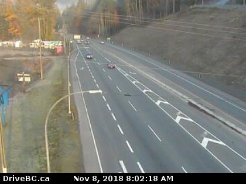

# traffic_density
Website getting image from traffic camera and returning traffic density

Link to this website: https://jorgealcubilla.github.io/traffic_density/

<object data="web_data/density.txt" type="text/plain">
width="300" style="height: 40px">
<a href="web_data/density.txt">Density</a>
</object>

